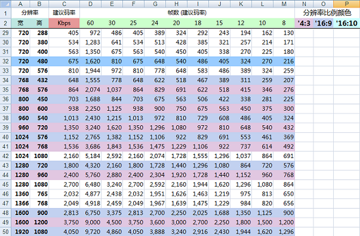
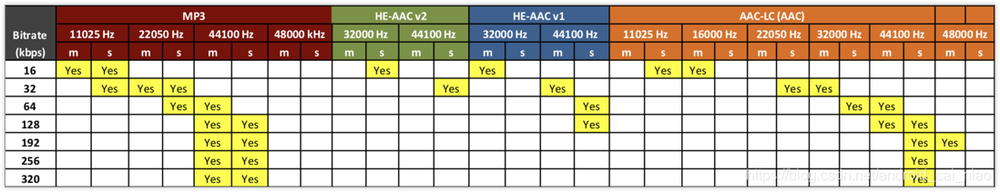

# Android vector标签 PathData 画图超详解

<https://www.cnblogs.com/yuhanghzsd/p/5466846.html>

<https://www.jianshu.com/p/c819ae16d29b>

**每个命令都有大小写形式，大写代表后面的参数是绝对坐标，小写表示相对坐标，相对于上一个点的位置。**

**参数之间用空格或逗号隔开。**

* M：move to 移动绘制点，作用相当于把画笔落在哪一点。
* L：line to 直线，就是一条直线，注意，只是直线，直线是没有宽度的，所以你什么也看不到。
* Z：close 闭合，嗯，就是把图封闭起来。
* C：cubic bezier 三次贝塞尔曲线
* Q：quatratic bezier 二次贝塞尔曲线
* A：ellipse 圆弧

* M (x y) 把画笔移动到x,y，要准备在这个地方画图了。
* L (x y) 直线连到x,y，还有简化命令H(x) 水平连接、V(y)垂直连接。
* Z，没有参数，连接起点和终点
* C(x1 y1 x2 y2 x y)，控制点（x1,y1）（ x2,y2），终点x,y 。
* Q(x1 y1 x y)，控制点（x1,y1），终点x,y
* C和Q会在下文做简单对比。
* A(rx ry x-axis-rotation large-arc-flag sweep-flag x y)

		rx ry 椭圆半径
		x-axis-rotation x轴旋转角度
		large-arc-flag 为0时表示取小弧度，1时取大弧度 （舍取的时候，是要长的还是短的）
		sweep-flag 0取逆时针方向，1取顺时针方向

## 额外说明

* C/c 三次贝塞尔曲线, 原理就是从当前点开始, 伸出到x1,y1(第一控制点)形成一条直线, 然后根据x2,y2(第二控制点) 与 x,y组成的直线进行弯曲，
中间的变化根据x1,y1 和 x2,y2连接的线进行变化

* Q/q 二次贝塞尔曲线, 原理就是从当前点开始, 经过x1,y1(控制点), 最终到x,y(终点), 形成一个曲线

* A/a 圆弧, rx, ry确定椭圆的半径, 相同就是圆, x-axis-rotation旋转角度, 就是坐标系的x轴, 45就是向右下旋转45度, 负值反向旋转。
sweep-flag从起点到终点是顺时针还是逆时针画圆弧。

    * large-arc-flag, 这个开始理解起来很难, 后来摸索出来, 其实就是当前点到x,y(终点)会画一个圆弧, 如果两个点之间的距离比直径(2个半径)短,
就会在直线一侧(根据sweep-flag顺/逆时针), 出现一个较大的圆弧, 但如果想要的是对面那个比较小的圆弧呢, 这个参数作用就是这个, 其实可以理解成把对面的画到这边来。 

# 分区存储

<https://open.oppomobile.com/wiki/doc#id=10432>

# 编码

* MediaCodec <https://juejin.cn/post/6844903725417365512>

* <https://ragnraok.github.io/android_video_record.html>

* 

* 
